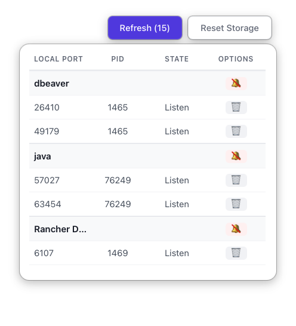

# Port scanner

<p align="center">
  
</p>

[](README.md)

A minimalistic system tray application built with **Tauri v2**, **Rust**, and **React** to monitor and manage active TCP listening ports on your machine.



## ✨ Features

- **Port Monitoring**: Real-time list of processes listening on TCP ports.
- **Process Management**: Terminate processes directly from the list.
- **Filtering**: "Skip" (hide) specific process names from the view. Persisted locally.
- **Auto-Refresh**: Automatically updates the list every 1.5 seconds.
- **System Tray Integration**:
  - Runs quietly in the background.
  - Left-click to toggle the management panel.
  - Context menu for quick exit.
- **Cross-Platform**: Designed for macOS, Windows, and Linux.

## 🛠️ Technology Stack

- **Backend**: Rust
  - [`sysinfo`](https://crates.io/crates/sysinfo): Robust process management and cross-platform kill commands.
  - [`netstat2`](https://crates.io/crates/netstat2): Network socket information retrieval.
  - `tauri-plugin-positioner`: Window positioning relative to tray icon.
  - `tauri-plugin-store`: Persistent settings storage.
- **Frontend**: React + TypeScript
  - **Vite**: Fast build tool.
  - **CSS**: Custom minimalistic design with no external UI framework dependencies.

## 🚀 Getting Started

### Prerequisites

- **Rust**: [Install Rust](https://www.rust-lang.org/tools/install)
- **Node.js**: [Install Node.js](https://nodejs.org/) (LTS recommended)
- **pnpm**: `npm install -g pnpm`

### Installation

1. Clone the repository:
   ```bash
   git clone <repository-url>
   cd port-scanner
   ```

2. Install frontend dependencies:
   ```bash
   pnpm install
   ```

3. Run in development mode:
   ```bash
   pnpm tauri dev
   ```

### Building for Production

To create a release build for your OS:

```bash
pnpm tauri build
```
The executable will be located in `src-tauri/target/release/bundle/`.

## 🖥️ Supported Environments

This application is verified to work on:

- **macOS**: Fully supported.
- **Windows**: Fully supported.
- **Linux (Ubuntu/GNOME)**: Supported.
  - *Note*: Tray icon behavior may vary depending on the Desktop Environment (DE). `libwebkit2gtk` and app indicator support may be required.

## 📂 Project Structure

- `src-tauri/src/lib.rs`: Main backend logic (Tray setup, port scanning, process killing).
- `src/components/SystemPortPanel.tsx`: Main UI component for the port list.
- `src/hooks/useSystemPort.ts`: State management and data fetching logic.

## 📄 Documentation

For more detailed information, check the `docs/` directory:
- [Backend Documentation](docs/en/backend.md)
- [Frontend Documentation](docs/en/frontend.md)
- [Cross-Platform Verification](docs/en/cross_platform_verification.md)
